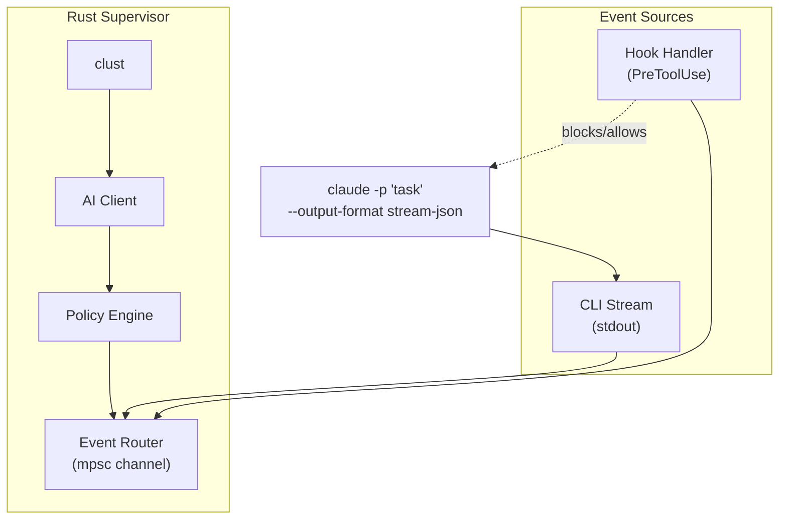

# Claude Supervisor

Automated Claude Code with AI oversight — a Rust-based supervisor that monitors Claude Code execution, prevents hallucinations, and intervenes in real-time.

## Project Goal

Build a supervisor layer that:
1. Runs Claude Code in non-interactive mode (`claude -p`)
2. Parses stream-json output in real-time
3. Evaluates actions against configurable policies
4. Escalates uncertain decisions to an AI supervisor
5. Can stop, guide, or force-continue Claude Code

## Architecture



## Commands

```bash
# Run with supervision
cargo run -- run "Fix the auth bug"

# With strict policy
cargo run -- run "Refactor database" --policy strict

# Auto-continue mode
cargo run -- run "Build feature" --auto-continue

# Run tests
cargo t                    # alias for cargo nextest run
cargo ta                   # with all features
```

## Code Conventions

### Module Structure

| Module | Purpose |
|--------|---------|
| `cli/` | Claude Code process spawning and stream parsing |
| `hooks/` | Hook binary handlers (PreToolUse, Stop) |
| `supervisor/` | Policy engine, state machine, orchestration |
| `ai/` | Claude API client for supervisor decisions |
| `config/` | TOML/JSON configuration loading |
| `watcher/` | File watching for conversation JSONL |
| `audit/` | SQLite audit logging |

### Error Handling

Use `thiserror` for error types:

```rust
#[derive(thiserror::Error, Debug)]
pub enum Error {
    #[error("Failed to spawn Claude: {0}")]
    SpawnError(#[from] std::io::Error),

    #[error("Policy violation: {0}")]
    PolicyViolation(String),
}
```

### Async Patterns

- Use `tokio::sync::mpsc` for event routing
- Use `tokio::process::Command` for Claude spawning
- Prefer `async fn` over manual futures

### Logging

Use `tracing` with structured fields:

```rust
tracing::info!(tool = %name, decision = "allow", "Tool call approved");
tracing::warn!(tool = %name, reason = %reason, "Tool call denied");
```

## Key Files

| File | Purpose |
|------|---------|
| `src/main.rs` | CLI entry point (clap) |
| `src/cli/stream.rs` | Stream-JSON parser |
| `src/cli/events.rs` | Event type definitions |
| `src/supervisor/policy.rs` | Policy engine |
| `src/supervisor/state.rs` | Session state machine |
| `src/hooks/pre_tool_use.rs` | PreToolUse hook handler |
| `src/ai/client.rs` | clust API wrapper |
| `src/ai/prompts.rs` | Supervisor system prompts |

## Resources

### Claude Code Documentation

- [Headless Mode](https://code.claude.com/docs/en/headless) — `-p` flag, output formats
- [Hooks](https://code.claude.com/docs/en/hooks) — Event types, configuration
- [Settings](https://code.claude.com/docs/en/settings) — Configuration options

### Rust Crates

| Crate | Docs | Purpose |
|-------|------|---------|
| `clust` | [docs.rs/clust](https://docs.rs/clust/0.9.0/clust/) | Claude API client |
| `tokio` | [docs.rs/tokio](https://docs.rs/tokio/latest/tokio/) | Async runtime |
| `serde` | [docs.rs/serde](https://docs.rs/serde/latest/serde/) | Serialization |
| `clap` | [docs.rs/clap](https://docs.rs/clap/latest/clap/) | CLI parsing |
| `notify` | [docs.rs/notify](https://docs.rs/notify/latest/notify/) | File watching |
| `rusqlite` | [docs.rs/rusqlite](https://docs.rs/rusqlite/latest/rusqlite/) | SQLite |
| `axum` | [docs.rs/axum](https://docs.rs/axum/latest/axum/) | Web framework |

### Similar Projects

| Project | Approach |
|---------|----------|
| [Auto Claude](https://github.com/ruizrica/auto-claude) | 12 parallel terminals, QA agents, worktrees |
| [Continuous Claude](https://github.com/AnandChowdhary/continuous-claude) | Loop + SHARED_TASK_NOTES.md |
| [Claude Code Guardrails](https://github.com/wangbooth/Claude-Code-Guardrails) | Hooks for branch protection |

### Claude Code Internals

| Location | Content |
|----------|---------|
| `~/.claude/settings.json` | Global settings, hooks config |
| `~/.claude/projects/<hash>/*.jsonl` | Conversation history |
| `~/.claude/projects/<hash>/subagents/*.jsonl` | Subagent conversations |
| `~/.claude/CLAUDE.md` | Global instructions |

## Claude Code CLI Reference

```bash
# Non-interactive with stream output
claude -p "task" --output-format stream-json

# Auto-approve specific tools
claude -p "task" --allowedTools "Read,Edit,Bash"

# Resume session
claude -p "continue" --resume <session_id>

# Add system prompt context
claude -p "task" --append-system-prompt "Extra context"
```

## Hook Response Format

### PreToolUse

```json
{
  "permissionDecision": "allow|deny|ask",
  "reason": "Why this decision was made",
  "updatedInput": { "modified": "parameters" }
}
```

### Stop

```json
{
  "decision": "allow|block",
  "reason": "Continue working on remaining tasks"
}
```

## Development

### Build Setup

```bash
# Install dependencies
sudo apt install mold clang
cargo install sccache cargo-nextest

# Enable sccache (uncomment in .cargo/config.toml)
# rustc-wrapper = "sccache"
```

### Pre-commit Hook

Runs automatically on commit:
- `cargo fmt --all -- --check`
- `cargo clippy --all-targets --all-features -- -D warnings`

### Testing

**ALWAYS use `cargo nextest run` (or alias `cargo t`) instead of `cargo test`.**

```bash
cargo t              # Run all tests (alias for cargo nextest run)
cargo t -- --no-capture  # With output
cargo ta             # All features
```

## Phases

See `roadmap.md` for detailed implementation plan.

| Phase | Status | Description |
|-------|--------|-------------|
| 1 | In Progress | Minimal viable supervisor |
| 2 | Planned | Hook integration |
| 3 | Planned | AI supervisor |
| 4 | Planned | Conversation awareness |
| 5 | Planned | Advanced features |

## Issues

Track progress: https://github.com/NikkeTryHard/claude-supervisor/issues
